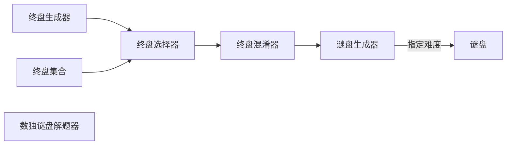

本篇主要是分析一下我自己编写的一个数独app里面的数独谜盘生成算法，算法可以生成指定难度的数独谜盘。而关于数独谜盘难度区分的标准，查看了很多资料，发现比较正确的三种区分方法：

- 空格自由度——每个空格可能填入的数字的数量为空格自由度，总空格自由度便是所有空格自由度的总和。往往一个空格可能填入的数字越多，思考难度就越大。所以在合理范围内，总空格自由度越高，难度就越高。
- 空格数量——根据空格数量划分难度。
- 给每一种数独解法给出难度分数，根据数独谜盘解题所需要用到的最佳解题方法（这个方法可能是基于几种基础或高级解法）所对应的难度综合分数来划分难度。

总空格自由度和空格数量其实是呈正相关的，但是总空格自由度难度区分方法并不完全等同于空格数难度区分方法。例如，空格数量相同的两个谜盘，总空格自由度不一定相同。不过，总的来说，空格数量越多，空格自由度就会随着变高。但是，并非总空格自由度越高，谜盘难度就会越高的。在极端的情况里，如果谜盘都是空格，则是总空格自由度最高的时候，但并非最难的，因为这个时候相当于让你自己写出一个数独终盘（数独谜盘的答案），即使可能有一定难度，但是会丧失趣味性。个人觉得，最好的方法是将总空格自由度定在最高总空格度的三分之一到三分之二的区间内；根据解法来区分谜盘难度可能是最为科学的，不过实现难度也比较高，而且这个是单纯的判定方法，无法在生成谜盘的同时指定难度，所以我并没有使用这种方法。在合理的范围内，空格数量和难度是呈正相关的。在基于__挖洞思想__的方法上，比较容易生成指定难度的谜盘，但是不容易细分难度等级，所以只提供了初级，中级和高级这三种难度。算法实现点击[这里](https://github.com/846400461/Sudoku-App/tree/master/app/src/main/java/com/dotbin/sudoku/algorithm)。

生成谜盘的流程图：



## 终盘生成器和终盘集合

所谓的终盘生成器，其实就是在一个空的数独盘上在一个随机的位置上从随机填入1至9，在11个随机位置填入1至9的随机数后，如果生成的不是合法的数独谜盘或是无解的数独谜盘，就再次重新生成，直到数独解题器得出终盘（答案）为止。部分代码如下：

```kotlin
/**
生成数独随机终盘
**/
private fun buildRandomSudokuKey(sudokuArray: Array<IntArray>) {
        do {
            //将数独矩阵数组值全部赋值为0
            ramSet.clear()
            for (i in sudokuArray.indices)
                for (j in sudokuArray[i].indices)
                    sudokuArray[i][j] = 0
            //随机在数独矩阵中的随机位置填入1~9的数字
            repeat(11) {
                var location = SudokuLocation((0..8).random(), (0..8).random(), 0)
                while (ramSet.contains(location)) {
                    location = SudokuLocation((0..8).random(), (0..8).random(), 0)
                }
                ramSet.add(location)
                sudokuArray[location.x][location.y] = (1..9).random()
            }
        } while (!SudokuSolver.getSolution(sudokuArray))//解题器，可以判断数独盘是否合法和可解，返回true 
    											    //的时候，生成终盘成功
    												
    }
```

终盘集合其实就是十个已经生成好的数独终盘，主要是因为数独随机生成终盘的耗时不太稳定，有时候可能很久都没有成功生成终盘。通过终盘选择器可以在数独随机生成终盘耗时太长时候，切换成终盘集合里面的终盘，即使是这样，通过终盘混淆器还是可以生成伪随机的数独谜盘的

## 数独谜盘解题器

解题器主要逻辑是先判断谜盘是否合法再进行解题，解题其实是使用了DFS（深度优先搜索），先尝试填入一个合法的数进入空格，然后在去填下一个数，如果发现下一个空格无解，那就回退到上一个空格，更换为另外一个合法的数。这个方法的时间复杂度比较高，最差可能到O(n^m^)，但是由于数独谜盘最多只有80个空格，而在生成终盘的时候，往往随机数生成的谜盘也不是唯一解，所以实际的生成终盘时间会比较短。但是偶尔会出现耗时比较长的情况。实现的部分代码如下：

```kotlin
private val solvedLocationStack = mutableListOf<SudokuLocation>()//用于记录已填入数字的空格坐标
private val solvingLocation = mutableListOf<SudokuLocation>()//用于记录未填入数字的空格坐标

/**
对数独矩阵算法进行封装，主要为了检查数组合法性和数独合法性以及初始化记录坐标的栈
**/
fun getSolution(sudokuArray: Array<IntArray>): Boolean {
    if (sudokuArray.size != 9)
        throw IllegalArgumentException("Illegal sudoku array size")
    sudokuArray.forEach {
        if (it.size != 9)
            throw IllegalArgumentException("Illegal sudoku array size")
    }
    //初始化栈，这里用list模仿栈
    solvedLocationStack.clear()
    solvingLocation.clear()
    for (x in sudokuArray.indices)
        for (y in sudokuArray.indices) {
            if (sudokuArray[x][y] == 0)
                solvingLocation.add(SudokuLocation(x, y, sudokuArray[x][y]))
        }
    //判断数独矩阵是否合法
    if (!isLegalSudoKuArray(sudokuArray))
        return false
    //调用真正的解题算法
    return realSolution(sudokuArray)
}

/*
数独解题算法
*/
private fun realSolution(sudokuArray: Array<IntArray>): Boolean {
    //判断数独矩阵是否已经是终盘
    if (solvingLocation.size == 0) return true
    //记录需要填入数字的空格数量
    val maxLocationSize = solvingLocation.size
    do {
        //从栈顶拿出一个需要填数字的空格
        var location = solvingLocation.first()
        //查找该空格可以填的数字，返回值不为零的时候，说明找到可填的数字
        val targetValue =
            findTarget(sudokuArray, location.x, location.y, location.lastValue)
        if (targetValue != 0) {
            sudokuArray[location.x][location.y] = targetValue
            location.lastValue = sudokuArray[location.x][location.y]
            //填入数字之后需要放入栈中记录，方便在下一个空格无解的时候回溯到上一个空格的坐标，然后重新填
            //数字
            solvedLocationStack.add(location)
            solvingLocation.removeAt(0)
            if (solvingLocation.size > 0)
                solvingLocation.first().lastValue = 0
        } else {
            //如果该栈为空，证明该数独盘无解
            if (solvedLocationStack.lastIndex == -1)
                return false
            //将上一个空格坐标取出，用于回溯
            location = solvedLocationStack.removeAt(solvedLocationStack.lastIndex)
            solvingLocation.add(0, location)
            sudokuArray[location.x][location.y] = 0
        }
    } while (solvedLocationStack.size != maxLocationSize)
    return true
}
```

## 终盘选择器

该模块主要作用是在随机终盘生成器耗时过长的时候，替换成生成好的数独终盘。主要是利用kotlin的协程进行的，协程有一点类似线程，是更加轻量的线程，使用协程可以避免出现很多回调函数，而且可以避免繁琐的线程之间通信的步骤，尤其是工作线程与UI线程之间的通信。其实协程并非kotlin先提出的，在C#和flutter上也有大量的语言级的支持，而kotlin主要是通过库函数提供支持，在嵌入式领域的实时系统FreeRTOS也曾经出过协程库，主要是为了支持一些低性能的8位机。这些例子都说明了，协程是非常轻量的，需要的资源要比线程更少。不过rxjava和线程池都有类似的作用，而且rxjava是比较成熟的异步框架（rxjava应该也是基于线程池）。部分实现代码如下：

```kotlin
fun generateSudokuPuzzle(sudokuDegree: SudokuDegree?) {
        val tempArr = Array(9) { IntArray(9) }
    //开启随机生成数独盘的协程
        val realGeJob = viewModelScope.launch {
            SudokuKeyBuilder.obtainSudokuKey(tempArr, true)
        }
    //开启协程
        viewModelScope.launch {
            delay(200)
            var tArray = tempArr
            //如果随机生成数独盘的协程，没有在指定时间内完成，停止该协程，并使用终盘集合的数据替代
            if (!realGeJob.isCompleted) {
                realGeJob.cancelAndJoin()
                Log.w("generateSudokuPuzzle","can not generate real random Puzzle")
            }
            while (!SudokuPuzzleBuilder.getSudokuPuzzle(
                    tempArr,
                    sudokuDegree ?: SudokuDegree.LOW
                )
            )
            {
                SudokuKeyBuilder.obtainSudokuKey(tempArr, false)
                tArray = tempArr
            }
            val cells =
                Array(9) { i ->
                    Array(9) { j ->
                        SudokuCell(
                            if (tempArr[i][j] == 0) Color.rgb(
                                54,
                                54,
                                54
                            ) else Color.rgb(105, 105, 105),
                            tempArr[i][j],
                            tempArr[i][j] == 0,
                            Color.WHITE
                        )
                    }
                }
            val baseInfo = SudokuBaseInfo(cells, SudokuState.UNFINISHED, 0)
            insertSudoku(SudokuGame(0, Date(), baseInfo, sudokuDegree, tArray))
        }
    }
```

## 终盘混淆器

主要是将数独盘的数字重新映射，例如1映射到9，9映射到8....，这样至少能生成9!种新的数独谜盘，给原本的数独盘增加了趣味性并且依然保持数独盘的唯一解特性，实现代码如下：

```kotlin
    private fun sudokuObfuscator(sudokuArray: Array<IntArray>){
        val baseNum= mutableListOf<Int>()
        while (baseNum.size!=9){
            val temp=(1..9).random()
            if(!baseNum.contains(temp))
                baseNum.add(temp)
        }
        for(i in sudokuArray.indices)
            for(j in sudokuArray[i].indices){
                sudokuArray[i][j]=baseNum[sudokuArray[i][j]-1]
            }
    }
```

## 谜盘生成器

谜盘生成器是基于挖洞的思想，主要是在一个终盘上将一个数字“挖掉“，然后再通过数独解题器解该盘，如果挖掉之后是该谜盘是唯一解，那么此次挖洞为有效，否则为无效。而且已经被判断为无效的格子，会被记录下来，确保不会出现重复挖无效的格子的情况。部分实现代码如下：

```kotlin
/**
谜盘生成算法封装函数，主要是为了检查参数是否合法
**/
fun getSudokuPuzzle(sudokuArray: Array<IntArray>, sudokuDegree: SudokuDegree): Boolean {
        if (sudokuArray.size != 9)
            throw IllegalArgumentException("Illegal sudoku array size")
        sudokuArray.forEach {
            if (it.size != 9)
                throw IllegalArgumentException("Illegal sudoku array size")
            it.forEach { num ->
                if (num == 0) throw IllegalArgumentException("Illegal sudoku array value")
            }
        }
		//调用真正的谜盘生成算法
        return when (sudokuDegree) {
            SudokuDegree.LOW -> getLowPuzzle(sudokuArray, (25..27).random())
            SudokuDegree.MIDDLE -> getLowPuzzle(sudokuArray, (35..40).random())
            SudokuDegree.HIGH -> getLowPuzzle(sudokuArray, (50..55).random())
        }

 }
    
/**
谜盘生成算法
**/
private fun getLowPuzzle(sudokuArray: Array<IntArray>, amount: Int): Boolean {
    val loSet = mutableSetOf<SudokuLocation>()//记录已经挖的空格
    val unLoSet = mutableSetOf<SudokuLocation>()//记录挖了会造成无唯一解的空格
    while (loSet.size < amount && (loSet.size + unLoSet.size) < 70) {
        val lo = SudokuLocation((0..8).random(), (0..8).random(), 0)
        if (loSet.contains(lo) || unLoSet.contains(lo))
            continue
        if (isEmptyCell(sudokuArray, lo.x, lo.y)) {
            sudokuArray[lo.x][lo.y] = 0
            loSet.add(lo)
        } else
            unLoSet.add(lo)
    }
    return loSet.size == amount
}
```

