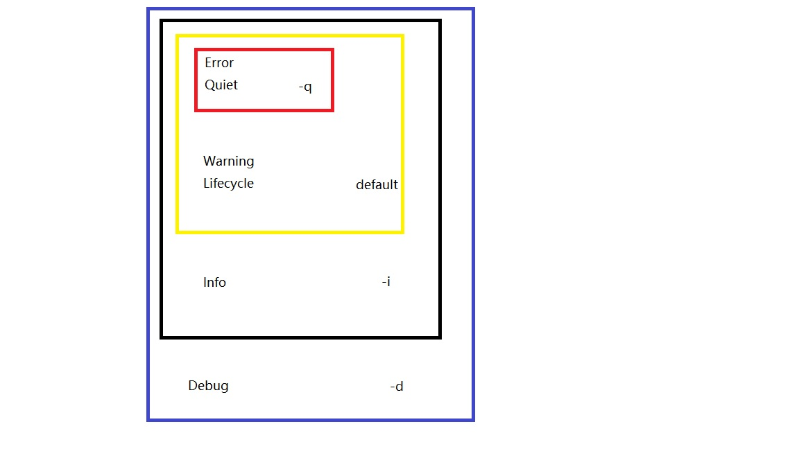

gradle是专注于灵活性和性能的开源构建自动化工具，而gradle的构建脚本可以使用Groovy和kotlin语言来编写，一般多数人会使用Groovy。

## gradle安装和命令行

标准gradle project目录大概如下：

```
.
├── build.gradle
├── gradle
│   └── wrapper
│       ├── gradle-wrapper.jar
│       └── gradle-wrapper.properties
├── gradlew
├── gradlew.bat
└── gradle.properties
```

在标准的gradle project 可以不用下载安装gradle，通过执行gradlew脚本便可以自动下载指定版本的gradle，具体下载什么版本以及其他配置选项主要由gradle-wrapper.properties文件决定，根据project的需求gradle-wrapper.properties内容可能不会一致，大概内容格式如下：

```shell
distributionBase=GRADLE_USER_HOME
distributionPath=wrapper/dists
distributionUrl=https\://services.gradle.org/distributions/gradle-6.0.1-bin.zip

##GRADLE_USER_HOME环境变量默认是$USER_HOME/.gradle，对应的目录是~/.gradle,zipStoreBase变量表示的是gradle
##压缩包存储的基础路径，gradle压缩包内包含对应版本的gradle可执行文件以及一些gradle的资源。
zipStoreBase=GRADLE_USER_HOME	

##zipStorePath环境变量是gradle存储路径的相当路径，在执行./gradlew后，会下载对应版本的gradle，而下载下来的
##的压缩包存储路径=zipStoreBase/zipStorePath=~/.gradle/wrapper/dists
zipStorePath=wrapper/dists		
```

如果仔细查看gradlew脚本的内容，会发现其实这个脚本就是检查当前环境是否合法（查看是有安装jdk），然后执行gradle-wrapper.jar，也就是说gradlew脚本依赖于gradle-wrapper.jar，并且gradle-wrapper.jar才是最终执行gradle相关操作的核心程序，所以想要通过gradlew自动下载gradle环境的前提：

- 安装java的运行环境
- 至少有gradle-wrapper.jar，gradle-wrapper.properties，gradlew（在win下是gradlew.bat）这三个文件。

如果你没有标准的gradle project的话，就需要去官网手动安装gradle，官网有详细的安装教程。这样安装也有好处，在执行gradle脚本的时候，不用每个project都自动安装一遍gradle。手动安装和自动安装gradle还有一点不同，就是使用gradle的命令行的时候，通过gradlew脚本自动安装的，gradle脚本是需要通过gradlew脚本来间接调用gradle构建工具；而手动安装的gradle可以直接使用gradle程序；例如当你查询gradle版本的时候：

```
gradle --version 		##手动安装gradle后查询版本的命令
./gradlew --version		##自动安装gradle后查询版本的命令
```

### 生成标准gradle project

前提：

- 安装java运行环境
- 在按照官网教程安装gradle完整版

执行命令：

> $ gradle wrapper

则会生成标准gradle project。这样可以在没有安装gradle或者安装的gradle版本与project使用的不一致的环境里，自动安装适合当前project的gradle版本，并且仅仅会在该project下安装，不会安装到系统当中。

## 任务配置

gradle将整个构建脚本委托给一个project对象，Gradle DSL的所有关键字都是该项目对象的属性或方法。这种委托方式有点像Groovy的闭包里面的委托对象，闭包可以访问其委托对象的属性和方法。

Groovy闭包委托对象的用例：

```groovy
//定义一个任务，名字可以自定义
task groovy {}

class GroovyGreeter {
    String greeting = "Default greeting"
    def printGreeting(){println "Greeting: $greeting"}
}
//初始化GroovyGreeter的实例
def myGroovyGreeter = new GroovyGreeter()
myGroovyGreeter.printGreeting()
myGroovyGreeter.greeting = "My custom greeting"
myGroovyGreeter.printGreeting()
//定义闭包
def greetingClosure = {
    greeting = "Setting the greeting from a closure"//调用委托对象的属性
    printGreeting()//调用委托对象的方法
}

greetingClosure.delegate = myGroovyGreeter//给闭包的委托对象赋值
greetingClosure() //调用该闭包

```

执行脚本：

> $ gradle groovy

执行脚本后的输出：

> Greeting: Default greeting
> Greeting: My custom greeting
> Greeting: Setting the greeting from a closure

### 定义任务

```groovy
/*
project 对象的task方法可以定义一个任务。task方法的参数是一个字符串和闭包（闭包是可省略参数），字符串用于定义任务名，闭包用于配置任务
*/
project.task("myTask1")

/*
由于整个构建脚本都委托给了project对象，所以我们可以省略'project'，直接调用task方法，默认会调用project对象的task方法。
*/
task("myTask2")

/*
由于Groovy的语法特点，我们输入参数的时候可以省略括号
*/
task "myTask3"

/*
Gradle会进入Groovy的执行模型，并使用一种叫做抽象语法树转换的高级Groovy功能，该功能可以去掉引号。在著名的问答社区stackoverflow已经有人提了相关的问题，想了解这一功能的更多详细内容可以访问以下链接：
http://stackoverflow.com/questions/27584463/understing-the-groovy-syntax-in-a-gradle-task-definition
*/
task myTask4
```

上面四种定义任务的方式，作用都是一样的

### 任务属性

```groovy
task myTask4
/*

这是一般的配置任务属性的方法，通过任务对象访问其属性

*/

myTask4.description = "This is what's shown in the task list"
myTask4.group = "This is the heading for this task in the task list,"

/*

这是配置任务的action，在任务的最后阶段执行该闭包

*/

myTask4.doLast {println "Do this last"}


myTask4.doFirst {println "Do this first"}

/*

在定义任务的同时可以通过传入配置闭包，对任务进行配置

*/

task myTask6 {
    description "Here's a task with a configuration block"
    group "Some group"
    doLast {
        println "Here's the action"
    }
}

/*

配置闭包的的委托对象是其对应task对象，所以在闭包内使用'group'跟在闭包外使用'task.group'是一样的。也就是说，配置闭包可以使用task对象的属性和方法

*/

task myTask7 {
    description("Description") 
    //description "Description" // 与上行有等同效果
    group = "Some group" 
    doLast { 
        println "Here's the action"
    }
}

/*

部分任务属性可以通过下面这种方式设置

*/

task myTask8(description: "Another description") {
    doLast {
        println "Doing something"
    }
}
```

任务描述和分组可以通过这个命令查看：

> $ gradle tasks

### 任务依赖和排序

任务之间的依赖性主要通过task对象的dependsOn属性和dependsOn方法实现。

#### dependsOn

当A任务***dependsOn*** B任务，B任务会先执行，然后在执行A任务。

```groovy
task putOnSocks {
    doLast {
        println "Putting on Socks."
    }
}

task putOnShoes {
    dependsOn "putOnSocks"	//通过dependsOn方法设置依赖
    doLast {
        println "Putting on Shoes."
    }
}

task takeShower {
    doLast {
        println "Taking a shower."
    }
}

task getReady {
    /*
     
     将一个任务名称集合赋值到dependsOn属性，需要使用等于符号。
    */
    dependsOn = ["takeShower", "putOnSocks", "putOnShoes"]
}
```

执行命令：

> $ gradle.bat -q putOnShoes

输出：

> Putting on Socks.
> Putting on Shoes.

执行命令：

> $ gradle.bat -q getReady

输出

> Putting on Socks.
> Putting on Shoes.
> Taking a shower.

执行命令的时候通过 -q参数可以让gradle静默输出，可以将调试信息屏蔽。

#### finalizedBy

```groovy
task eatBreakfast {
    finalizedBy "brushYourTeeth"//在eatBreakfast任务执行完成后，将执行brushYourTeeth任务
    doLast{
        println "Om nom nom breakfast!"
    }
}

task brushYourTeeth {
    doLast {
        println "Brushie Brushie Brushie."
    }
}
```

执行命令：

> $gradle.bat -q eatBreakfast

输出：

> Om nom nom breakfast!
> Brushie Brushie Brushie.

#### shouldRunAfter

在takeShower任务和putOnFragrance任务同时执行的时候，将会先执行takeShower任务

```groovy
task takeShower {
    doLast {
        println "Taking a shower."
    }
}

task putOnFragrance {
    shouldRunAfter "takeShower"
    doLast{
        println "Smellin' fresh!"
    }
}
```

执行命令：

> $ gradle takeShower putOnFragrance

命令行输出：

> Taking a shower.
> Smellin' fresh!

#### mustRunAfter

与shouldRunAfter有类似的作用，不过有点不同。根据gradle手册阐述了不同点：

> The “should run after” ordering rule is similar but less strict as it will be ignored in two situations. Firstly if using that rule introduces an ordering cycle. Secondly when using parallel execution and all dependencies of a task have been satisfied apart from the “should run after” task, then this task will be run regardless of whether its “should run after” dependencies have been run or not. You should use “should run after” where the ordering is helpful but not strictly required.

### Gradle DSL

Gradle官方提供一些预配置的任务，可以更简单的去做复制，压缩和编译等基础操作。Gradle DSL则是这些接口的使用文档。

#### 示例

```groovy
task copyTask(type: Copy)//通过type变量来确定任务类型


task copyImages(type: Copy) {//将imags目录下的文件复制到build目录
    from 'images'	
    into 'build'
}

task copyJpegs(type: Copy) {//将imags目录下的文件以及所有jpg文件复制到build目录
    from 'images'
    include '*.jpg'
    into 'build'
}
task copyImageFolders(type: Copy) {//将imags目录下的jpg文件复制到build/jpeg目录，将imags目录下的gif文件
    from('images') {			  //复制到build/gif目录
        include '*.jpg'
        into 'jpeg'
    }

    from('images') {
        include '*.gif'
        into 'gif'
    }

    into 'build'
}

//压缩文件示例
task zipImages(type: Zip) {
    baseName = 'images'
    destinationDir = file('build')
    from 'images'
}

task zipImageFolders(type: Zip) {
    baseName = 'images'
    destinationDir = file('build')

    from('images') {
        include '*.jpg'
        into 'jpeg'
    }

    from('images') {
        include '*.gif'
        into 'gif'
    }
}
//删除文件实例
task deleteBuild(type: Delete) {
    delete 'build'
}

```

#### 自定义任务类型

```groovy
class MyTask extends DefaultTask {}//继承DeDefaultTask类

class HelloTask extends DefaultTask {
    //任务执行的时候需要进行的操作
    @TaskAction
    void doAction() {
        println 'Hello World'
    }
}

task hello(type: HelloTask)

class HelloNameTask extends DefaultTask {
    String firstName

    @TaskAction
    void doAction() {
        println "Hello, $firstName"
    }
}

task helloName(type: HelloNameTask) {
    firstName = 'Jeremy'
}

```

自定义任务类型需要定义一个类并继承DefaultTask类。

### 日志记录



Gradle会以6种级别的日志信息来进行日志记录。从图中可以看出，低级别的信息包含高级别信息。所以严格来说，所有日志信息都是Debug信息。

根据执行命令时候传入的参数，会显示不同的级别的信息，例如显示Debug级别及以上的信息

> gradle -d taskNameXXX

下面这个是参数和对应输出的日志信息级别的表：

| Option             | Outputs Log Levels                           |
| :----------------- | :------------------------------------------- |
| no logging options | LIFECYCLE and higher                         |
| `-q` or `--quiet`  | QUIET and higher                             |
| `-w` or `--warn`   | WARN and higher                              |
| `-i` or `--info`   | INFO and higher                              |
| `-d` or `--debug`  | DEBUG and higher (that is, all log messages) |